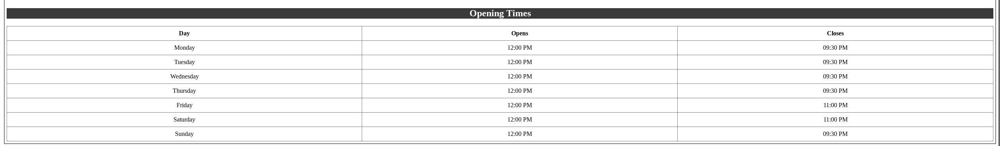
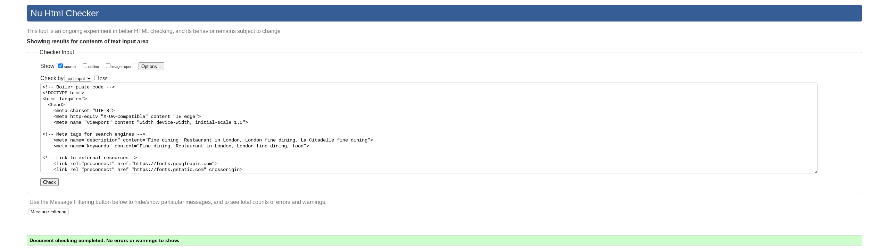

# La Citadelle
---
The website for La Citadelle was created to provide an online presence for a fine dining restaurant.
Users will be able to view La Citadelles opening times, book a table or arrange a private dining/event specific to thier needs. Its tended purpose was to build on a brand and attract and engage customers. The website is compatible on all devices and is easy to navigate with a minimalist approach. In addition they can view the restaurants social media pages and the menus before they visit the restaurant.

## Features

### Index.html page

* **Navigation**
 * Featured underneath the main header, the navigation menu includes the following links:

    * **Home**, Which will revert back to the main page (index.html).
    * **About**, Which will allow the user to jump to the about us section of the homepage.
    * **Bookings**, wWich will enable the user to go to the bookings page (bookings.html). Here the user can review the events we can offer in additon to making a reservation.
    * **Menu**, Should the user which to view the lunch, dinner, dessert or wine menu they can do so.
    * **Contact**, This will enable the user the view our contact informaton for making a reservation.

* The navigation was small enough to not need a drop down menu and the text color makes it stand out from the background colour applied.
* The navigation menu lists are easy to understand and allow the user to understand the different sections of the website which allows for a greater user experience.

    

* **The Header**
* Featured at the top of the page, the header contains the main header at the center of the page which allows the user to reverts back to the homepage if clicked. 

* **The About Us Section
* The About us section provides details regarding the fine dining restaurant including various events they can accommodate.

* **Contact Us**
* The Contact us section provides contact details including address, contact telephone and email address for reservations and highlights the reservations form found
on the bookings page. It also makes reference to the opening times (I did not provide a separate link to this in the navigation bar as it was unnecessary and due to the testing with different screen sizes it shows when on the contact us page).

* **Opening Times**
* This provides opening and closing times should the user wish to book a table

### Bookings.html page
* **Events & Private Dining**
* **Reservations Form**

### Menu.html page
* **Lunch Menu**
* **Dinner Menu**
* **Dessert Menu**
* **Wine Selection**

Retake screen shots for main nav menu
reservations form
Footer
Contact us section
Replace current images with new screen shots

<!-- Images to add -->
<!-- index.html hompage -->

<!-- bookings.html page -->

<!-- menu.html page -->

<!-- testing -->

<h2>Table of Contents</h2>

<ol>
<li>Introduction</li>
<li>About La Citadelle</li>
<li>Getting Started</li>
<li>Features</li>
<li>Menu</li>
<li>Reservations</li>
<li>Contact Information</li>
<li>Feedback and Support</li>
<li>Legal Information</li>
</ol>

<h3>1. Introduction</h3>

Welcome to La Citadelle Fine Dining Restaurant in London! This readme file provides essential information about our establishment, making reservations, and accessing our menu.

<h3>2. About La Citadelle</h3>

La Citadelle is a prestigious fine dining restaurant located in the heart of London. We are committed to delivering an exquisite culinary experience in an opulent and inviting setting. Our menu showcases a wide array of the finest dishes, skillfully prepared by our world-class chefs using the freshest, locally-sourced ingredients.

<h3>3. Getting Started</h3>

To start your journey with La Citadelle, you have several options:
Visit us: We are conveniently located at [Carlos Pl, London W1K 2AL].
Visit our website: LaCitadelle.co.uk
Make reservations: Contact us by phone at: [+44 20 4513 5208]

<h3>5. Features</h3>

La Citadelle offers an array of features and services, including:

<h3>Elegant dining rooms with a refined atmosphere</h3>

An extensive wine list curated by expert sommeliers
A private dining area for special occasions and events
Attentive and knowledgeable staff to cater to your needs
An array of delectable desserts and aperitifs
Seasonal and special tasting menus

<h3>5. Menu</h3>

Our ever-evolving menu is available on our website. It is regularly updated to reflect seasonal and chef's special creations. Whether you have a penchant for seafood or are a vegetarian, our menu caters to every palate, promising a memorable dining experience.

<h3>6. Reservations</h3>

We highly recommend making reservations in advance to secure your table at La Citadelle. You can reserve a table through the following channels:
<ul>
<li>Online reservation system on our website</li>
<li>By phone at [+44 20 4513 5208]</li>
<li>In person at our restaurant</li>
</ul>
  
<h3>7. Contact Information</h3>

For any inquiries or further information, please do not hesitate to get in touch with us:
<ul>
<li>Address: Carlos Pl, London W1K 2AL</li>
<li>Phone: +44 20 4513 5208</li>
<li>Email: Reservations@LaCitadelle.co.uk</li>
</ul>
  
<h3>8. Feedback and Support</h3>

We genuinely value your feedback and are dedicated to providing you with an exceptional dining experience. If you have any comments, suggestions, or require support, please feel free to reach out to us via email at Reservations@LaCitadelle.co.uk. Your input is invaluable, and we are committed to continuously enhancing our services.

<h3>9. Legal Information</h3>

Terms of Service: Please refer to our terms of service on our website.
Privacy Policy: For insights into our privacy practices, consult our privacy policy on our website.
Thank you for selecting La Citadelle Fine Dining Restaurant in London. We eagerly await the opportunity to serve you and create a memorable dining experience!
